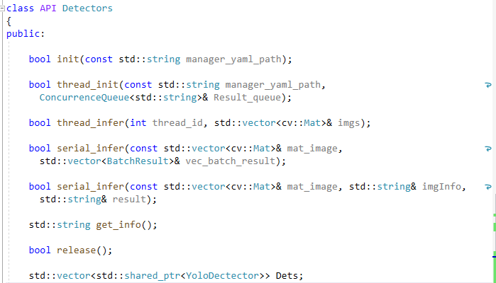
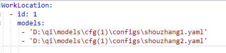
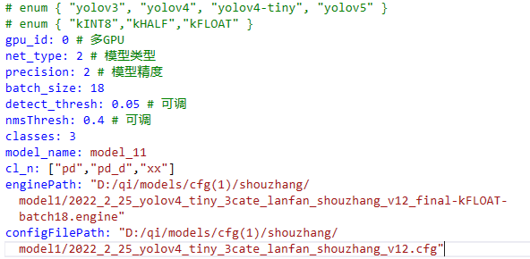
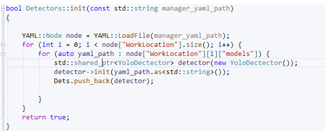
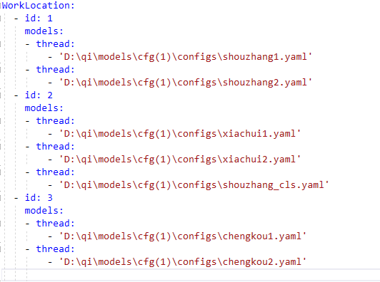
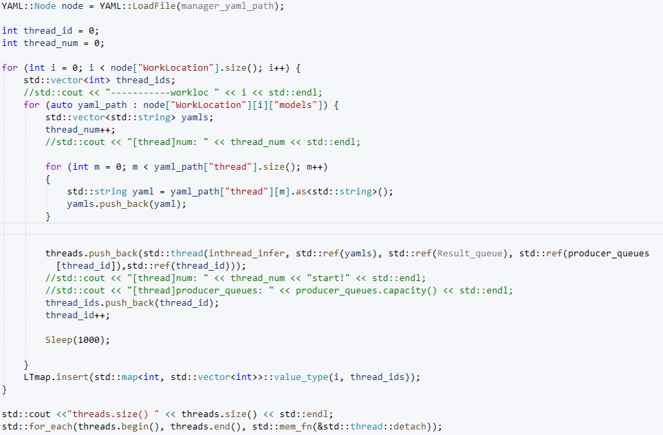

# DLL接口说明

DLL 接口说明。

## 接口

## 依赖

json

yaml

opencv 4.5.4

tensorrt 8.2.1.5

cuda 11.2

cudnn 8.2

## 配置文件

### 串行Yaml 

#### 说明

由Java端调用进行实现，以工位为单位区分线程，所以各个工位需保证解耦性。

整个任务由M个工位管理YAML组成。

每个工位任务由一个工位管理Yaml及N个模型Yaml组成。

#### 格式

|  |
| ------------------------------------------------------------ |
| 工位管理YAML                                                 |
|  |
| 模型Yaml                                                     |

#### 实现

### 并行Yaml

#### 说明

由C++调用实现，以模型为单位区分线程，无需再在工位层面解耦

整个任务只用一个管理Yaml及N个模型Yaml组成。

#### 格式

|  |
| ------------------------------------------------------------ |
| 管理Yaml（负责区分工位和线程）                               |
|  |
| 模型Yaml                                                     |

#### 实现

